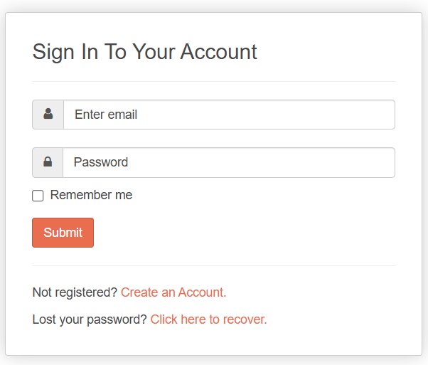
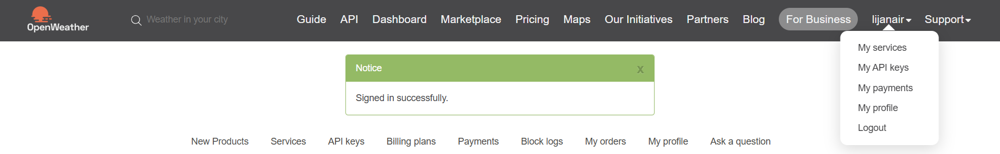

# Introduction

Welcome to the **Weather & Task API documentation**. This API provides two powerful sets of endpoints designed to help developers integrate weather data and task management capabilities into their applications with ease.

## The Weather & Task API provides two sets of functionalities:

- A simple `/weather` endpoint for retrieving real-time weather by city. It’s ideal for apps that need to:
  - Display live temperature
  - Show weather descriptions
  - Customize content based on location

- A `/tasks` endpoint offering a full-featured task management system. Developers can:
  - Create, read, update, and delete tasks (CRUD)
  - Retrieve paginated task lists
  - Perform partial updates (PATCH)
  - Use query parameters for flexible data fetching
  - Handle rate limits gracefully using standard HTTP headers

This documentation is your complete guide to integrating and using the **Weather & Task API** efficiently. Whether you’re building a weather widget or a productivity tool, you’ll find all the examples, parameters, and error handling you need to succeed.


## Getting Started: Obtain an API Key

Follow these steps to get your API key from OpenWeatherMap for use with the Weather API:

1. Go to the [OpenWeatherMap website](https://openweathermap.org/).
2. Click on **Sign in** to your account.

    
  
   *Figure: Postman Login Screen*

   > *If you don’t have an account, click **Create an Account** and register.*

3. Once signed in, click on your profile name in the top menu.
4. From the dropdown, select **My API keys**.

   

   *Figure: My API Key*

   > *You’ll see your existing API keys listed.*

5. Do one of the following:
   - Copy an existing key, or  
   - Click **Generate** to create a new API key. Copy the new API key.

> ⚠️ These API keys are secret and should not be shared with anyone. Treat them like passwords.

6. Optionally, give your API key a name for easy identification.

## Authentication

Authentication is the process of verifying the identity of a client before granting access to the API.

This API uses an **API key** to authenticate requests. Including the correct API key in your request headers is required to access protected endpoints. It ensures that only authorized users can use the service and helps track usage per user.

> 🔑 **Refer to the [Getting Started](#getting-started-obtain-an-api-key)** section to learn how to obtain your API key.


# Pagination

Pagination refers to dividing a large set of results into smaller, manageable chunks or "pages." When fetching data like task lists or weather logs, pagination prevents overloading the client and server with too much data at once. It also helps improve performance and allows users to navigate through data efficiently using `page` and `limit` parameters.

### For endpoints returning large datasets (e.g., `/tasks`):

Use the following query parameters:

- `page`: Page number (default: 1)  
- `limit`: Items per page (default: 10, max: 100)

#### Example

```http
GET /tasks?page=2&limit=20
```


## Rate Limiting

The API enforces **rate limiting**, which restricts the number of API requests a client can make within a specified time period. To maintain server performance and ensure fair access for all users, this API limits the number of requests based on the user’s subscription level.

If the limit is exceeded, the API returns a `429 Too Many Requests` error. This helps protect the API from abuse and overload.

- **Limit:** 60 requests per minute

### Response Headers

- `X-RateLimit-Limit`: Max requests allowed  
- `X-RateLimit-Remaining`: Requests left  
- `Retry-After`: Time to wait before retrying after hitting the limit

### On Exceeding Limit

```http
HTTP/1.1 429 Too Many Requests
Content-Type: application/json

{
  "error": "Rate limit exceeded. Please try again later."
}
```

